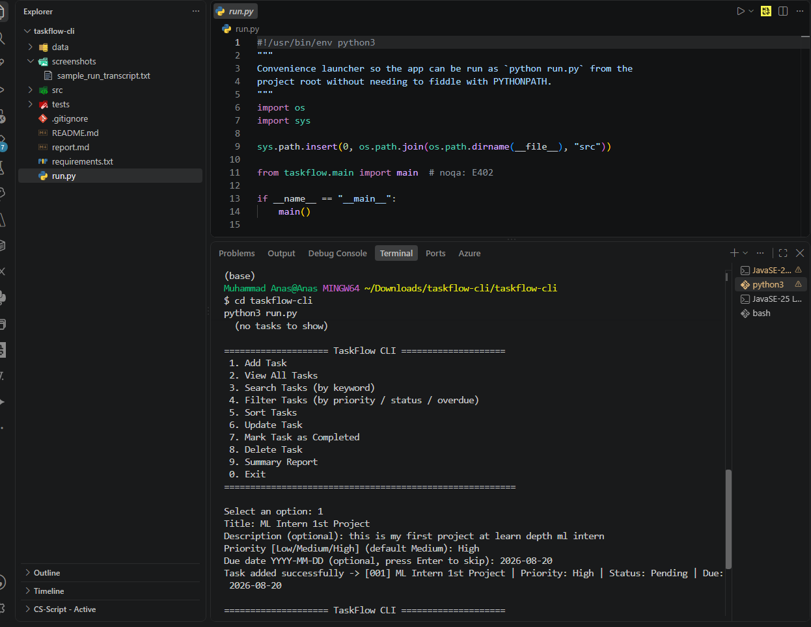
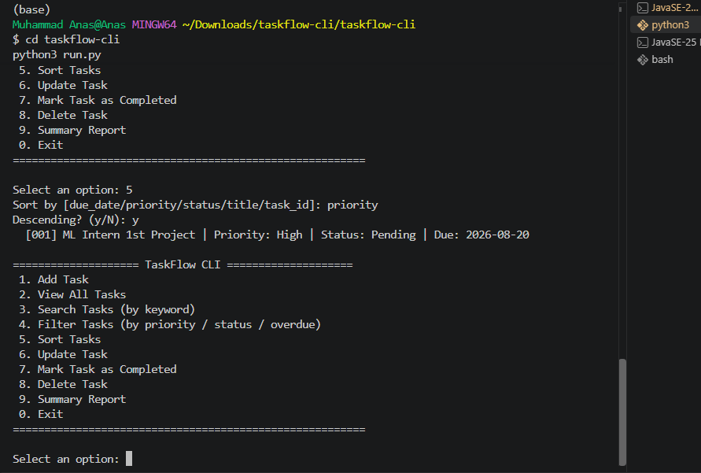
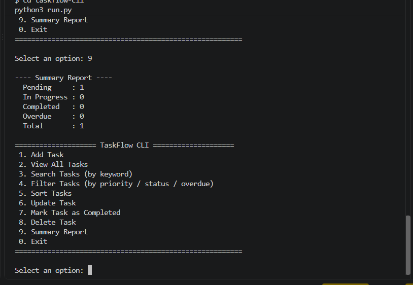

# TaskFlow CLI — Enterprise Task Management Console


**TaskFlow CLI** is an enterprise-grade, modular, menu-driven command-line task management suite built in pure standard Python. Developed as part of the **Learn Depth Machine Learning Internship — Track 1 (Level-4 Python Project Challenge: Project #8)**.

The project demonstrates clean software architecture, object-oriented design patterns, persistent JSON storage with atomic writes, custom exception management, and strict input validation.

---

## Technical Highlights & Architecture

- **Clean Layered Architecture:** Clear separation of concerns between data models (`task.py`), persistence handling (`storage.py`), business logic (`task_manager.py`), and UI presentation (`main.py`).
- **Atomic JSON Persistence:** Safe multi-transaction handling preventing file corruption during hardware or process interrupts.
- **Custom Exception Handling:** Hierarchical exception structure isolating standard Python errors from domain logic failures.
- **Dynamic Overdue Engine:** Real-time state computation evaluating task deadlines against system clock without manual intervention.
- **Zero External Dependencies:** Native standard library implementation ensuring 100% cross-platform compatibility and zero security exposure from third-party packages.

---

## Features Summary

- **Task Creation & Validation:** Add tasks with auto-formatted IDs, priority levels (`Low`, `Medium`, `High`), optional descriptions, and dynamic ISO date verification (`YYYY-MM-DD`).
- **Advanced Query Engine:** Search by title/description keywords, filter by priority or completion state, and query overdue items dynamically.
- **Flexible Sorting:** Sort dataset by priority hierarchy, due date, status, title, or system ID in ascending/descending orders.
- **Atomic CRUD Operations:** Complete task updating, status toggling, and permanent record deletion.
- **Executive Status Summary:** Integrated analytics engine displaying aggregated counts, pending metrics, and overdue task ratios.
- **Resilient File Parsing:** Fault-tolerant storage parser that safely flags and isolates corrupted individual JSON entries without crashing the application state.

---

## Repository Structure

```text
taskflow-cli/
├── run.py                       # Application Entry Launcher
├── src/
│   └── taskflow/
│       ├── __init__.py          # Package initialization
│       ├── main.py              # CLI Interface & Navigation Manager
│       ├── task.py              # Core Task Domain Model & Serialization
│       ├── task_manager.py      # Business Logic, Filter/Sort & Aggregations
│       ├── storage.py           # Atomic JSON Storage Layer
│       └── exceptions.py        # Domain Custom Exception Hierarchy
├── data/
│   └── tasks.json               # Auto-initialized JSON Database
├── tests/
│   └── test_task_manager.py     # Unit Testing Suite (10 Test Cases)
├── screenshots/                 # Demonstration & Execution Screenshots
├── LICENSE                      # MIT Open Source License
├── README.md                    # Project Documentation
└── report.md                    # In-depth Technical Architecture Report
```

---

## Installation & Setup

### Prerequisites
- Python 3.9 or higher

### Environment Setup
1. Clone the repository:
   ```bash
   git clone https://github.com/Farhanillahiclass/taskflow-cli.git
   cd taskflow-cli
   ```

2. Confirm Python availability:
   ```bash
   python3 --version
   ```
   *(No additional package installation required — zero cost and zero dependency setup).*

---

## Running the Application

Execute the entry launcher from the root folder:

```bash
python3 run.py
```

### Interactive CLI Walkthrough

```text
==================================================
              TASKFLOW CLI MANAGER
==================================================
1. Add Task
2. View All Tasks
3. Search Tasks
4. Filter Tasks
5. Sort Tasks
6. Update Task
7. Mark Task Complete
8. Delete Task
9. View Executive Summary
0. Exit
==================================================
Select an option: 1

Title: Implement Cross-Validation Pipeline
Description: Complete 5-fold CV for model evaluation
Priority [Low/Medium/High] (default Medium): High
Due date YYYY-MM-DD (optional): 2026-08-25

[SUCCESS] Task added: [001] Implement Cross-Validation Pipeline | Priority: High | Status: Pending | Due: 2026-08-25
```

---

## Testing & Quality Assurance

The application features a comprehensive unit testing suite using Python's native `unittest` framework.

Run the test suite:
```bash
python3 -m unittest discover -s tests -v
```

### Automated Test Matrix

| ID | Test Scenario | Category | Expected Result |
| :--- | :--- | :--- | :--- |
| **TC-01** | Add Valid Task | Functional | Task initialized with auto-generated ID |
| **TC-02** | Empty Title Input | Boundary / Validation | Raises `ValidationError` |
| **TC-03** | Malformed Date Input | Validation | Rejects invalid format (`YYYY-MM-DD` enforced) |
| **TC-04** | Overdue Detection | Business Logic | Correctly flags past due dates as overdue |
| **TC-05** | Completed Overdue Task | Business Rule | Completed tasks never register as overdue |
| **TC-06** | Invalid Task ID Lookup | Exception | Raises `TaskNotFoundError` |
| **TC-07** | Duplicate Title Assignment | Edge Case | Assigns distinct unique primary keys |
| **TC-08** | Storage Persistence Reload | Data Integrity | Serializes and recovers data accurately from disk |
| **TC-09** | Priority Sorting Order | Logic | Correctly orders `High` > `Medium` > `Low` |
| **TC-10** | Delete Record | Data Modification | Removes entity permanently from dataset |

---

## Demonstration Evidence

Visual records of the operational CLI and unit test execution:

### 1. Task Creation & Input Validation


### 2. View All Tasks & Sorting


### 3. Executive Analytics Dashboard


### 4. Automated Unit Testing Suite


## Limitations

- **Single-Node Execution:** Designed for single-user local CLI operations without remote concurrency locking.
- **Date Granularity:** Tracks due dates at day resolution (`YYYY-MM-DD`) without precise timestamping.

---

## Future Roadmap

- **Export Subsystem:** Export task ledgers to structured CSV and Markdown reports.
- **Relational Storage:** Optional SQLite storage adapter alongside JSON persistence.
- **Rich Terminal UI:** Enhanced styling with colored status tags and progress meters.

---

## License

Distributed under the **MIT License**. See `LICENSE` for more information.

**Author:** Muhammad Farhan  
**LinkedIn:** [https://www.linkedin.com/in/muhammadfarhanmrs](https://www.linkedin.com/in/muhammadfarhanmrs)  
**Repository:** [https://github.com/Farhanillahiclass/taskflow-cli](https://github.com/Farhanillahiclass/taskflow-cli)
